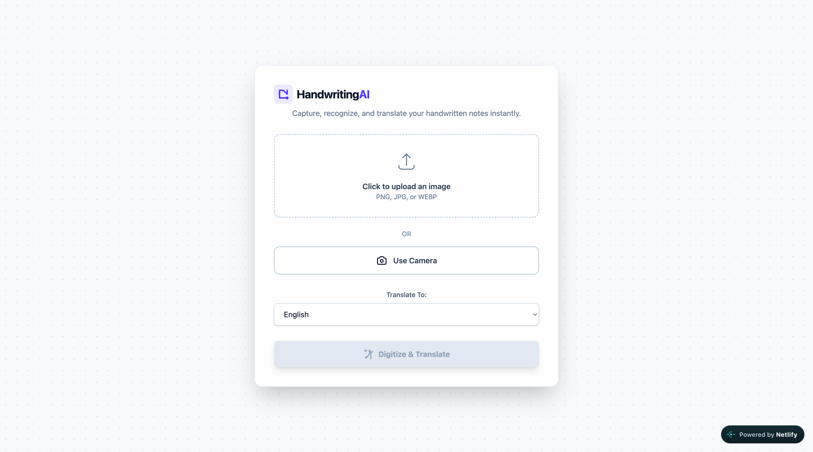
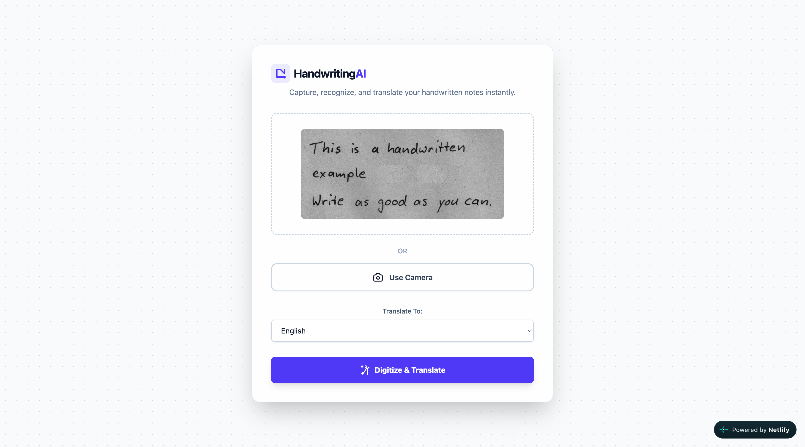
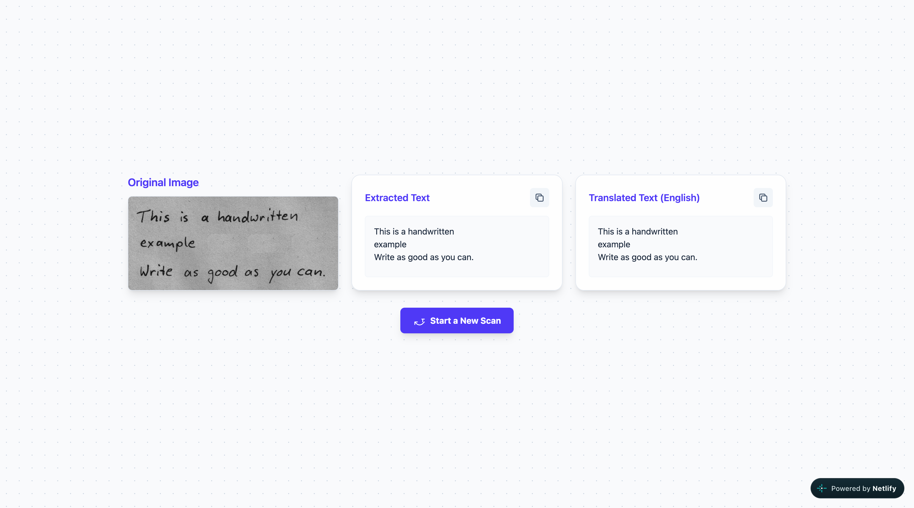

# ✍️ Handwriting AI

**Handwriting AI** is a modern web application that allows users to capture, digitize, and translate handwritten or printed notes instantly using the power of Generative AI.

[](https://vercel.com/new/clone?repository-url=https://github.com/your-username/handwriting-digitizer-translator)
[](LICENSE)
[](https://www.typescriptlang.org/)
[](https://reactjs.org/)

## 🚀 Features

- **📸 Multi-Modal Input**: Upload images (PNG, JPG, WEBP) or use your device's camera to capture notes in real-time.
- **🔍 AI-Powered OCR**: Leverages Google's Gemini 2.5 Flash model to extract text from images, supporting both printed and handwritten scripts across multiple languages.
- **🌐 Instant Translation**: Translate extracted text into 20+ target languages seamlessly.
- **✨ Modern UI**: A clean, responsive interface built with React and Tailwind CSS, featuring a glassmorphism design and smooth transitions.
- **📱 Mobile Ready**: Optimized for mobile browsers with native camera integration.
- **📱 PWA Support**: Install as a native-like app on mobile/desktop for offline caching and better camera access.
- **🕐 Local History**: Last 5 scans saved locally in browser; one-click to reload previous results.
- **🎨 Skeleton Loaders**: Smooth loading placeholders instead of spinners.
- **🔔 Toast Notifications**: Non-intrusive error/success feedback.
- **♿ Accessible**: Full keyboard navigation, ARIA labels, live regions.

## 🌐 Live Demo

**[View Live Demo →](https://your-project.vercel.app)** *(Deploy your own using the button above)*

## 🛠️ Tech Stack

- **Frontend**: [React](https://reactjs.org/) 19 + [Vite](https://vitejs.dev/)
- **Styling**: [Tailwind CSS](https://tailwindcss.com/)
- **AI Engine**: [Google Gemini AI](https://ai.google.dev/) (Gemini 2.5 Flash)
- **Language**: [TypeScript](https://www.typescriptlang.org/)
- **PWA**: [vite-plugin-pwa](https://github.com/vite-pwa/vite-plugin-pwa)
- **Toasts**: [react-hot-toast](https://react-hot-toast.com/)

## 📦 Installation & Setup

### Prerequisites

- Node.js (v18 or later)
- A Google Gemini API Key ([Get one here](https://aistudio.google.com/))

### Steps

1. **Clone the repository**
   ```bash
   git clone https://github.com/your-username/handwriting-digitizer-translator.git
   cd handwriting-digitizer-translator
   ```

2. **Install dependencies**
   ```bash
   npm install
   ```

3. **Environment Configuration**
   Create a `.env` file in the root directory and add your API key:
   ```env
   VITE_GEMINI_API_KEY=your_api_key_here
   ```

4. **Run the application**
   ```bash
   npm run dev
   ```
   Open `http://localhost:3000` in your browser.

## 🚀 Deploy to Vercel (Free)

1. Push this repo to GitHub.
2. Go to [vercel.com](https://vercel.com) and sign in with GitHub.
3. Click **Add New... → Project** → Import this repo.
4. Build settings auto-detect (Vite). Output directory: `dist`.
5. In **Environment Variables**, add:
   - `GEMINI_API_KEY` = your Gemini API key
6. Click **Deploy**.
7. Your app is live at `https://your-project.vercel.app` 🎉

The `vercel.json` handles SPA routing automatically.

## 📖 How It Works

1. **Capture**: User uploads an image or takes a photo using the integrated camera.
2. **Digitize**: The image is sent to the Gemini AI model with a specialized prompt to perform high-accuracy OCR on handwritten text.
3. **Translate**: The extracted text is then processed by the AI to translate it into the user's selected target language.
4. **Review**: The original image, extracted text, and translated text are displayed side-by-side for easy verification.
5. **History**: Recent scans are cached locally for quick re-access.

## 🖼️ Screenshots

| Home Page | Processing | Results |
|---|---|---|
|  |  |  |

*Add screenshots to the `screenshots/` folder for them to appear here.*

## 🤝 Contributing

Contributions are welcome! Please feel free to submit a Pull Request.

## 📄 License

This project is licensed under the MIT License.